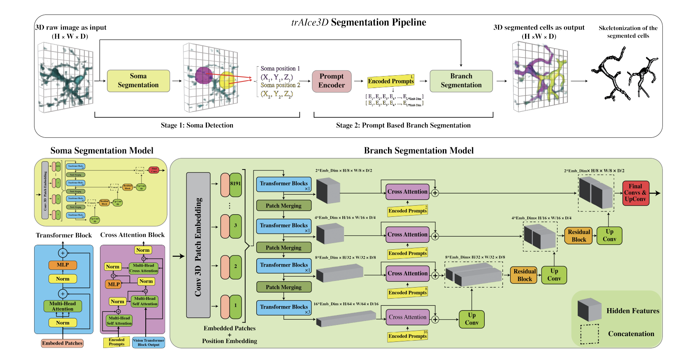

# trAIce3D: A Prompt-Driven Transformer Based U-Net for Semantic Segmentation of Microglial Cells

This repository contains the official implementation of **$trAIce3D$**, a deep-learning architecture for precise microglia segmentation from large-scale 3D microscopy images.



## Abstract

The shape of a cell contains essential information about its function within the biological system. Segmenting these structures from large-scale 3D microscopy images is challenging, limiting clinical insights especially for microglia, immune-associated cells involved in neurodegenerative diseases. Existing segmentation methods mainly focus on cell bodies, struggle with overlapping structures, perform poorly on noisy images, require hyperparameter tuning for each new dataset, or rely on tedious semi-automated approaches. We introduce trAIce3D, a deep-learning architecture designed for precise microglia segmentation, capturing both somas and branches. It employs a two-stage approach: first, a 3D U-Net with vision transformers in the encoder detects somas using a sliding-window technique to cover the entire image. Then, the same architecture, enhanced with cross-attention blocks in skip connections, refines each soma and its branches by using soma coordinates as a prompt and a 3D window around the target cell as input. Training occurs in two phases: self-supervised Soma Segmentation, followed by prompt-based Branch Segmentation, leveraging pre-trained weights from the first phase. Trained and evaluated on a dataset of 41,230 microglial cells, trAIce3D significantly improves segmentation accuracy and generalization, enabling scalable analysis of complex cellular morphologies. While optimized for microglia, its architecture can extend to other intricate cell types, such as neurons and astrocytes, broadening its impact on neurobiological research.


## Installation

To get started, clone the repository and install the required dependencies:

```bash
git clone https://github.com/AminAlam/trAIce3D.git
cd trAIce3D
pip install -r requirements.txt
```

You can customize the training parameters, such as the learning rate, batch size, and model architecture, by editing the scripts in `training` folder and then run the scripts for the training or inference.

## Citation

If you use this code or the associated dataset in your research, please cite the following paper, available on [arXiv](https://arxiv.org/abs/2507.22635):

```
@inproceedings{alamalhoda2025traice3d,
  title={$trAIce3D$: A Prompt-Driven Transformer Based U-Net for Semantic Segmentation of Microglial Cells from Large-Scale 3D Microscopy Images},
  author={Alamalhoda, MohammadAmin and Firoozi, Arsalan and Venturino, Alessandro and Siegert, Sandra},
  booktitle={International Conference on Medical Image Computing and Computer-Assisted Intervention},
  year={2025},
  organization={Springer}
}
```

## License

This project is protected by a patent. Please see the `LICENSE` file for more details.

## Patent

The methods and architectures described in this repository are protected by a patent. For commercial use, please contact the authors.
